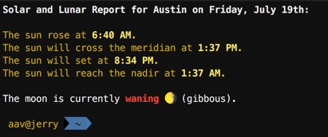

# suncalc

Calculates and displays the times of sun events and the disposition of the moon.

You'll need to take a look at the folders in the install.sh and the city name in suncalc.py and make sure they're correct for your environment and location.

## Packages Used

- [pyephem](https://astral.readthedocs.io/en/latest/)
- [Astral](https://astral.readthedocs.io/en/latest/)
